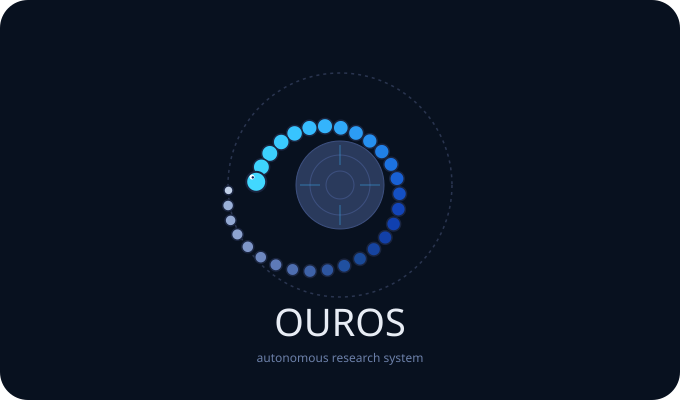

<p align="center">
  
</p>

# Ouros

Ouros is an autonomous research system for closed-loop scientific discovery. The long-term system
coordinates specialist agents for literature review, hypothesis generation, methodology design,
experiment execution, analysis, and reflection while keeping the human researcher in the loop.

The main technical specification is `autonomous_research_system_techspec.docx`.

## Current Status

Milestone 1 is implemented: a walking skeleton that runs from a research problem to a ranked
hypothesis report in the console.

Milestone 1 scope:

- Python project foundation.
- SQLite blackboard and typed agent contracts.
- Literature review agent using Semantic Scholar and arXiv.
- Hypothesis generation agent using LiteLLM and Ollama.
- LangGraph DAG: `problem -> lit review -> hypothesis -> console output`.
- Ruff linting, Ruff format checks, tests, and GitHub checks.

Out of scope for Milestone 1: Gradio UI, long-term ChromaDB memory, Phase 1 RL, Trinity-RFT,
experiment execution, statistical analysis, and human checkpoint panels.

See `docs/milestone-1-implementation-plan.md` for the detailed plan.

## Prerequisites

- Python 3.11 or newer.
- `uv` for dependency management and local commands.
- Ollama running locally for model-backed agent calls.
- Local models from the spec, for example:

```bash
ollama pull llama3.1:8b
ollama pull mistral:7b
```

Ollama should be reachable at `http://localhost:11434` unless `OLLAMA_BASE_URL` is set.

## Setup

```bash
uv sync --dev
```

Optional dependency groups are available for later milestones:

```bash
uv sync --dev --extra analysis --extra memory --extra interface --extra observability
```

## Checks

Run the same checks used by CI:

```bash
uv run ruff format --check .
uv run ruff check .
uv run pytest
```

To format locally:

```bash
uv run ruff format .
```

## Run Milestone 1

```bash
uv run ouros "How can small language models improve literature review quality?" --tag ml
```

This creates a run in the SQLite blackboard, searches academic sources, asks the configured
hypothesis model for structured JSON, validates the output, writes agent handoffs to the blackboard,
and prints a ranked hypothesis report.

## Configuration

Configuration lives in `config/`:

- `config/system.yaml` contains storage paths, orchestrator limits, blackboard settings, memory
  placeholders, and RL phase flags.
- `config/models.yaml` maps each agent to its model string.
- `config/trinity.yaml` is present for the Phase 2 upgrade path but is not used in Milestone 1.

No secrets should be committed. Use environment variables for optional provider keys:
`ANTHROPIC_API_KEY`, `OPENAI_API_KEY`, `LANGSMITH_API_KEY`, and `WANDB_API_KEY`.

## Repository Layout

```text
.
├── config/
├── docs/
├── src/ouros/
├── tests/
├── autonomous_research_system_techspec.docx
├── ouros_logo.svg
├── uv.lock
└── pyproject.toml
```

## Roadmap

- Milestone 1: walking skeleton with literature review, hypothesis generation, blackboard, and
  console output.
- Milestone 2: full six-agent pipeline with terminal human checkpoints.
- Milestone 3: ChromaDB memory and Phase 1 contextual bandit.
- Milestone 4: Gradio human interface.
- Milestone 5: Trinity-RFT fine-tuning after sufficient human-scored runs and GPU availability.
